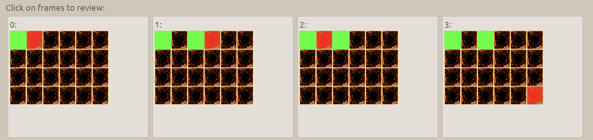
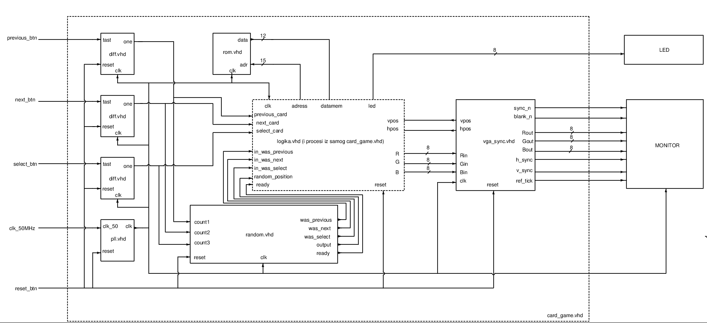

# card-game-fpga

VHDL implementation of a memory card game on an FPGA, featuring VGA output at 1024×768, a 4×6 card grid with randomized color pairs, and three-button navigation to flip and match cards.



---

## Demo

The game displays a 4×6 grid of 24 face-down cards (12 color pairs) on a VGA monitor. The player navigates the grid with three buttons, flips cards to reveal their color, and tries to find all matching pairs. The game tracks time and signals completion when all pairs are matched.

---

## Hardware

- **FPGA board:** DE1-SoC / compatible Altera board
- **Display:** VGA monitor, 1024×768 @ 60 Hz
- **Input:** 3 push buttons — Next card, Previous card, Select/Flip card
- **Output:** VGA (R/G/B 8-bit), 8 LEDs (elapsed time indicator)

---

## Project Structure

```
.
├── card_game/
│   └── card_game.vhd       # Top-level entity — VGA rendering, card logic, component wiring
│   └── Logika.vhd          # Game logic — card selection, match detection, state machine
│   └── vga_sync.vhd        # VGA sync signal generator (1024×768@60Hz)
│   └── rom.vhd             # ROM storing card face bitmap
│   └── pll.vhd             # PLL for VGA pixel clock generation
│   └── diff.vhd            # Edge detector (debounce) for button inputs
├── random/
│   └── random.vhd          # LFSR-based random number generator for card shuffling
├── schematic.png           # System block diagram
├── preview.PNG             # In-game screenshot
└── README.md
```

---

## Architecture



The top-level `card_game` entity wires together seven components:

| Component | Role |
|-----------|------|
| `pll` | Generates the pixel clock from the 50 MHz board clock |
| `vga_sync` | Produces VGA sync signals and current pixel coordinates |
| `rom` | Stores the 170×192 card face bitmap (12-bit color) |
| `random` | LFSR random number generator — shuffles card positions at game start |
| `diff` | Edge detector on each of the three buttons |
| `Logika` | Game state machine — tracks cursor, flips, matches, and elapsed time |
| `card_game` (top) | `AddressCalculation`, `CardSelectionProcess`, `DisplayProcess`, `WriteProcess` |

---

## How to Play

1. Power on — cards are shuffled randomly each session.
2. Use **Next** / **Previous** buttons to move the cursor across the grid.
3. Press **Select** to flip the highlighted card and reveal its color.
4. Flip a second card — if the colors match, both cards stay revealed.
5. If they don't match, both cards flip back face-down.
6. Match all 12 pairs to finish. Elapsed time is shown on the LEDs.

---

## Build & Flash

1. Open the project in **Intel Quartus Prime**.
2. Assign pins according to your board's pin assignment file (`.qsf`).
3. Compile (`Processing → Start Compilation`).
4. Program the board (`Tools → Programmer`).

---

## Authors

**Aleksandar Petoš** & **Aleksa Stevanić**  
Course: Introduction to VLSI Systems Design — December 2022

---

## License

[MIT](LICENSE)
